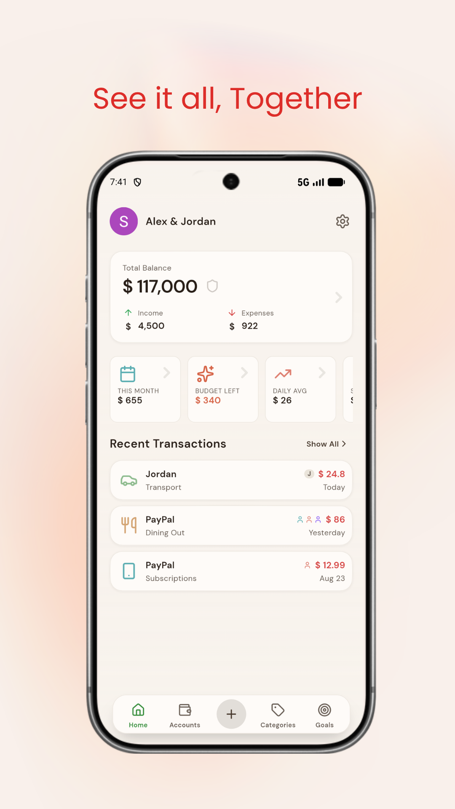
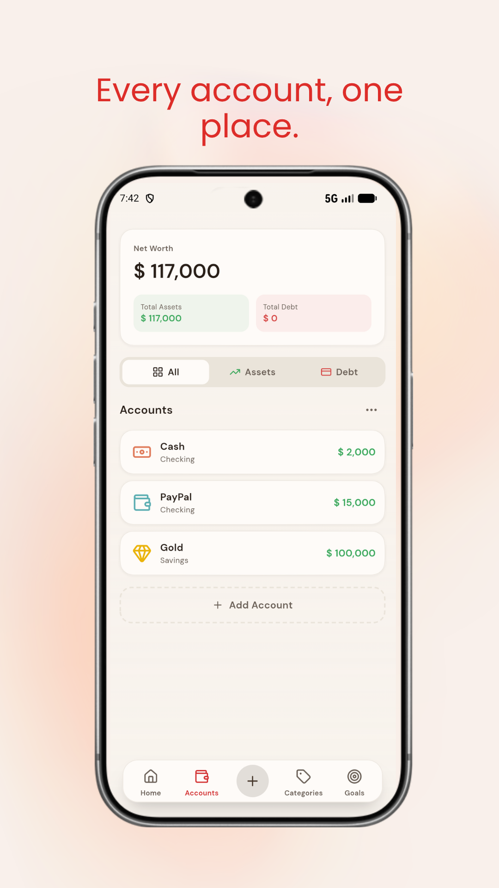
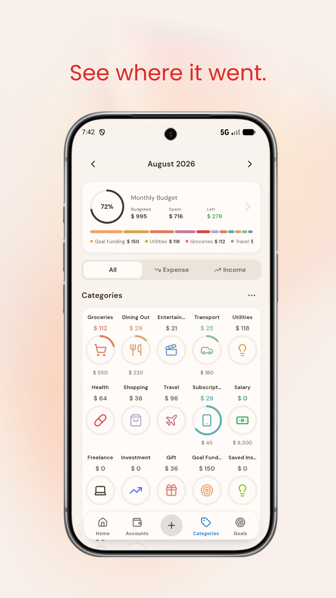
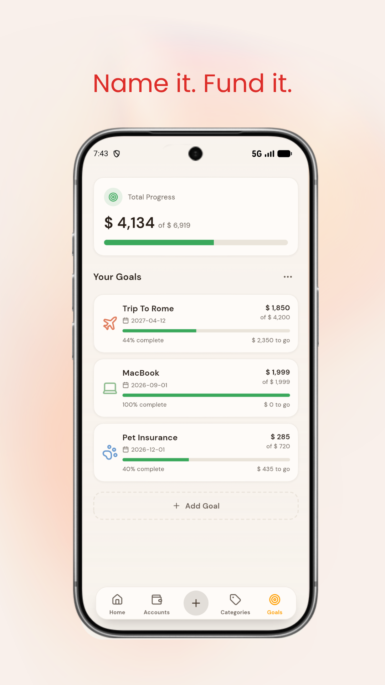
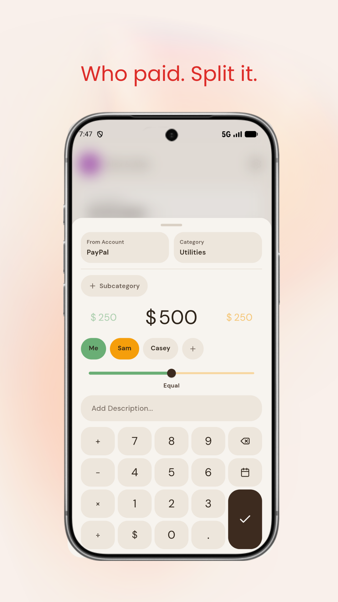

# Soheil Ravasani

Senior software engineer in Istanbul.

I build production backends with Python, Django, and FastAPI. I also ship web apps in React and Android apps in Flutter. I care about reliable systems and about interfaces people can actually use.

## Work
- Londonist DMC — student and partner products, internal CRM, company site, Flutter apps, Docker, CI/CD, monitoring
- AGTEQ — part-time remote backend work for an agriculture AI platform
- Earlier — G Corp, then MehrTakhfif, Django services with PostgreSQL, Redis, Celery, and Elasticsearch

## Products

### Tamoom
Android productivity app. Things 3 as the reference point, built for daily tasks without noise.

- **Who it's for:** people who want a serious task app on Android
- **What I cared about:** structure, speed, visual hierarchy, gestures, empty states, backup
- **Hard problem:** long lists still have to feel instant, including when the phone is offline
- **Stack:** Flutter
- **Live:** [Tamoom.app](https://tamoom.app)
- **Play Store:** [Tamoom](https://play.google.com/store/apps/details?id=com.tamoom&hl=en)

  
  
  
  
  

### Mantar
Offline-first shared expenses on Android.

- **Who it's for:** roommates, trips, couples, small groups
- **What I cared about:** working with no network, clear split UI, trust in the numbers
- **Hard problem:** every add, edit, and split has to work on the device first, then sync when there is a connection
- **Stack:** Flutter
- **Play Store:** [Mantar](https://play.google.com/store/apps/details?id=com.soheilravasani.mantar&hl=en)

  
  
  
  
  

### [NiliRazaghi](https://nilirazaghi.ir)
Photography portfolio. Performance and media.

## Stack
Python, Django, FastAPI, PostgreSQL, Redis, Docker, React, Flutter

## Links
- LinkedIn: https://linkedin.com/in/soheil-ravasani
- Email: soheilravasani@gmail.com
