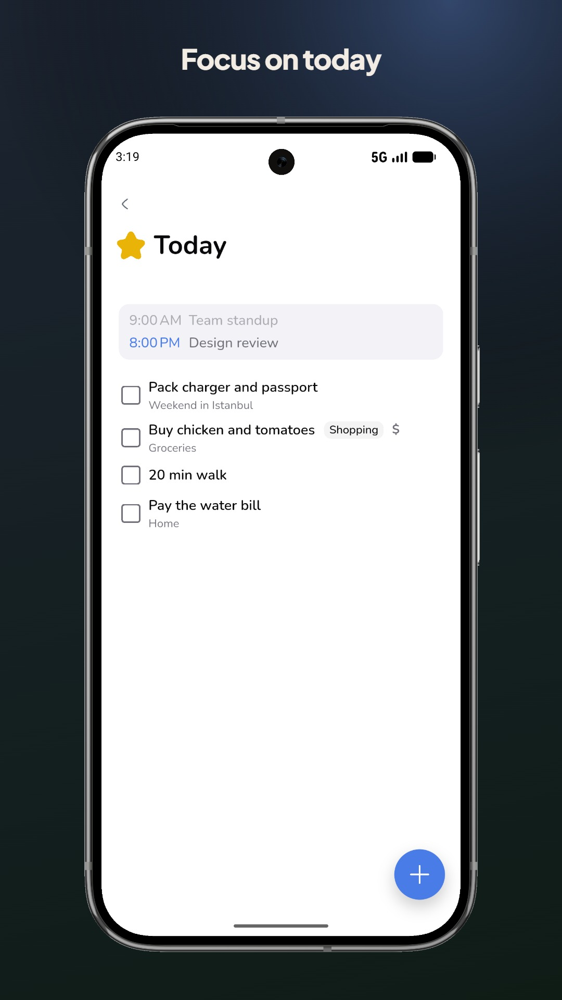
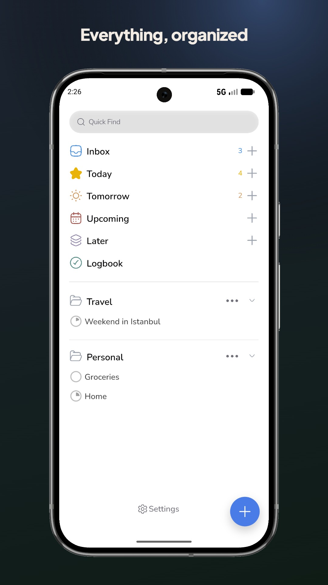
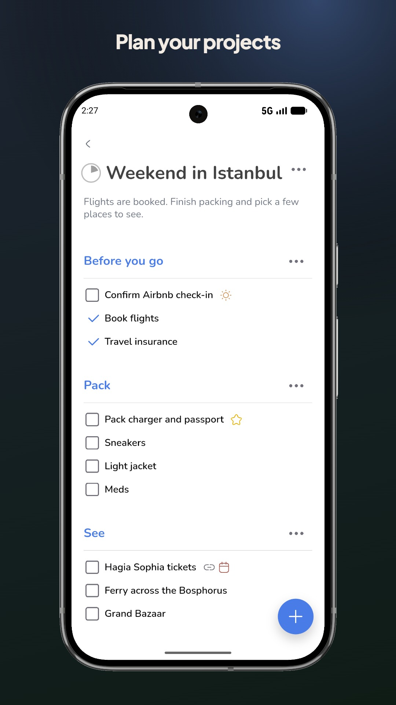
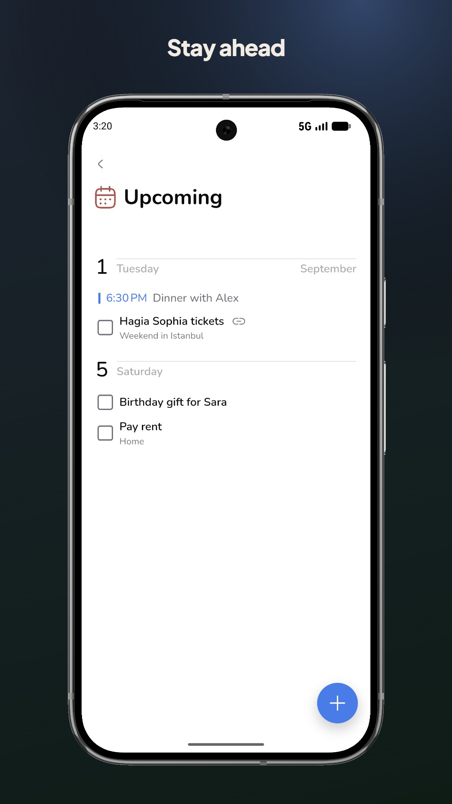
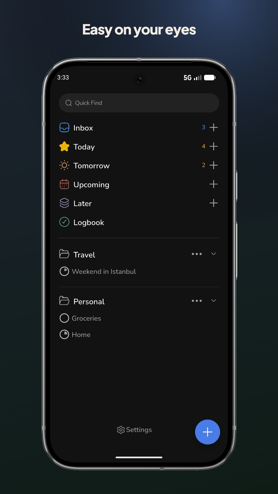
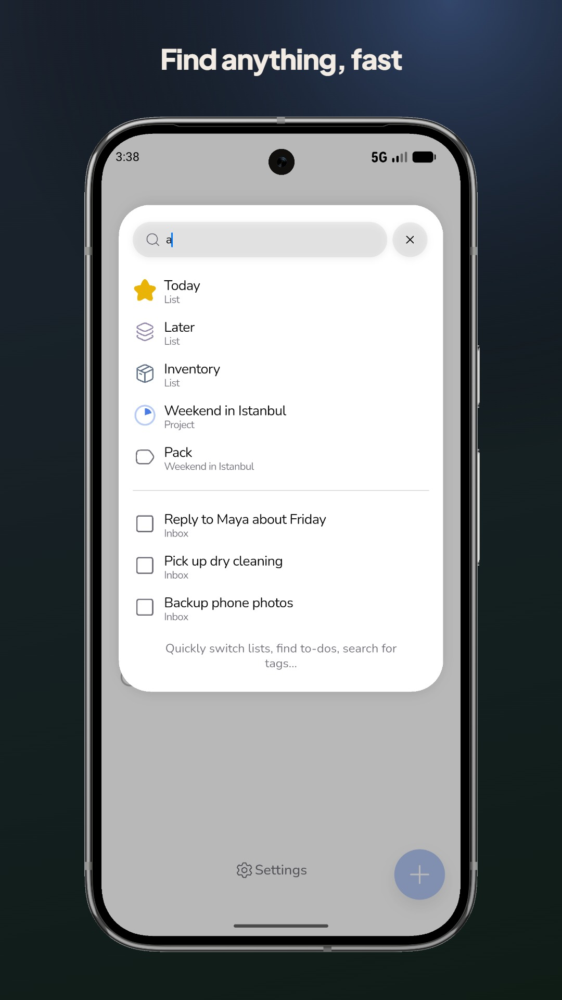
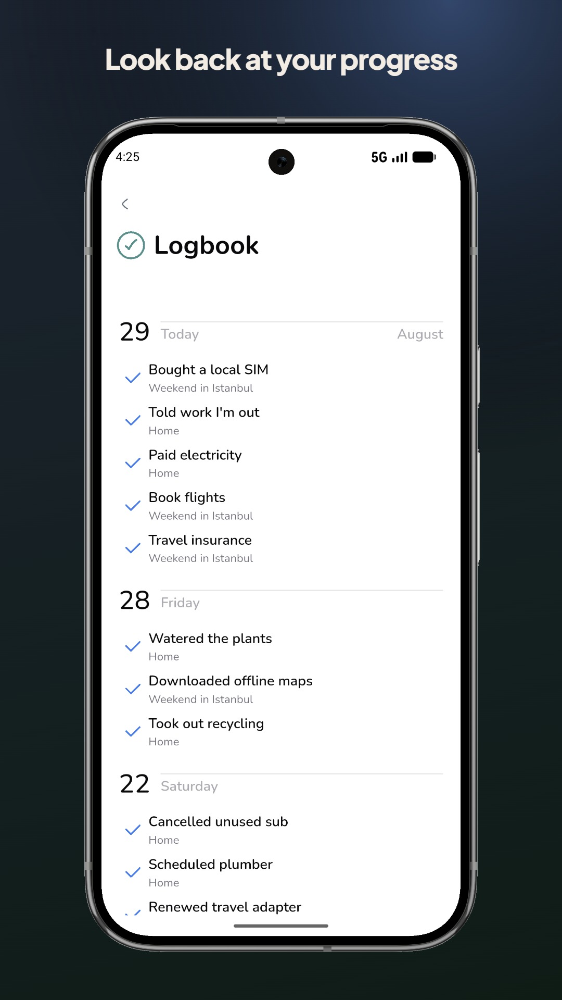

# Soheil Ravasani

Senior software engineer in Istanbul.

I build production backends with Python, Django, and FastAPI. I also ship web apps in React and Android apps in Flutter. I care about reliable systems and about interfaces people can actually use.

## Work
- Londonist DMC — student and partner products, internal CRM, company site, Flutter apps, Docker, CI/CD, monitoring
- AGTEQ — part-time remote backend work for an agriculture AI platform
- Earlier — G Corp, then MehrTakhfif, Django services with PostgreSQL, Redis, Celery, and Elasticsearch

## Products
- Tamoom
    What it is: Android productivity app, Things 3 as the reference point, built for daily tasks without noise
    Who it is for: people who want a serious task app on Android
    What I cared about: structure, speed, visual hierarchy, gestures, empty states, backup
    Stack: Flutter
    Live: https://tamoom.app
    Play Store: https://play.google.com/store/apps/details?id=com.tamoom&hl=en
    One paragraph on a hard problem: offline use, performance of lists, or navigation. Pick one that is true

  
  
  
  
  
  
  

- Mantar
    What it is: offline-first shared expenses on Android
    Who it is for: roommates, trips, couples, small groups
    What I cared about: working with no network, clear split UI, trust in the numbers
    Stack: Flutter
    Play Store: https://play.google.com/store/apps/details?id=com.soheilravasani.mantar&hl=en
    One paragraph on the offline model in plain language
    Screenshots: group list, add expense, balance view
- [NiliRazaghi](https://nilirazaghi.ir) — photography portfolio, performance and media

## Stack
Python, Django, FastAPI, PostgreSQL, Redis, Docker, React, Flutter

## Links
- LinkedIn: https://linkedin.com/in/soheil-ravasani
- Email: soheilravasani@gmail.com
